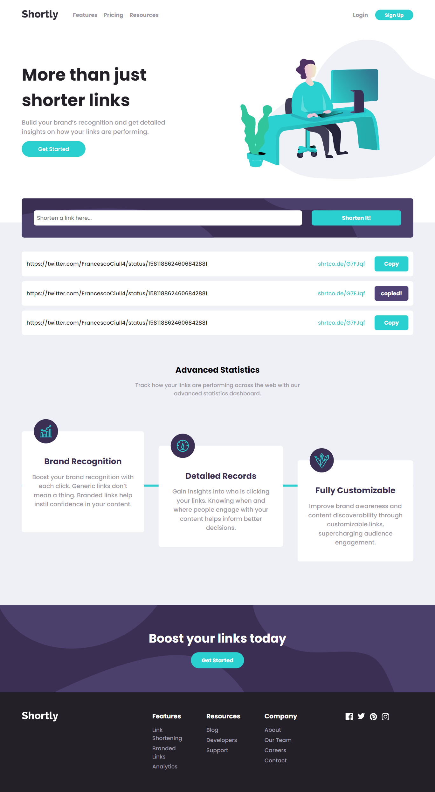

# Frontend Mentor - url shortening API

### Built with

- Semantic HTML5 markup
- scss
- Flex-box
- Grid
- Mobile-first
- Shrtcode API

### Links 

- Live Site URL: [Live Site](https://luancerqueira1.github.io/url-shortening-api-master/)

### Screenshots

The desktop design VS My desktop solution 
 

 

The mobile design VS My mobile solution 

